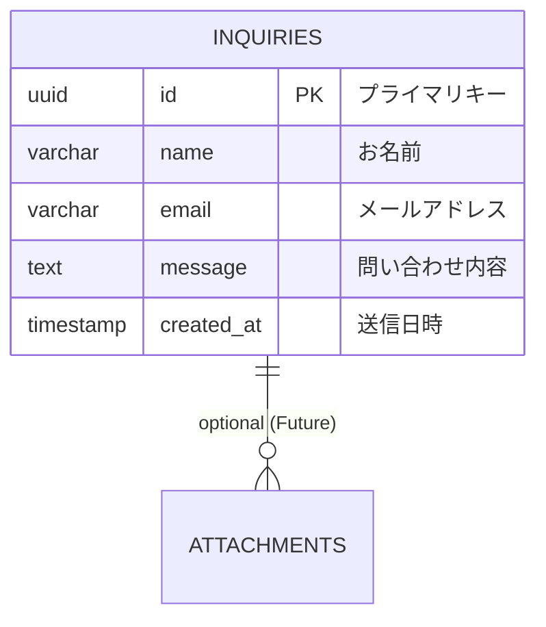

# データベース設計 (Database Design)

- **対象プロジェクト名**: 西川農園 コーポレートサイト
- **参照元**: `detailed_requirements_specification.md` (7. データベース設計)
- **更新日**: 2026-02-01

## 1. 目的
本サイトにおけるデータの格納方法および構造を定義する。

## 2. 方針
- **最小構成**: サイトの性質上、動的なデータは「問い合わせ」のみであるため、テーブル構成は最小限に留める。
- **SaaS利用**: Supabase (PostgreSQL) を利用し、運用の手間を削減する。

## 3. ER図

## 4. テーブル定義

### 4.1 `inquiries` (お問い合わせ)

| カラム名 | 型 | 制約 | 説明 |
|---|---|---|---|
| `id` | uuid | PK, Default: gen_random_uuid() | 問い合わせの一意識別子 |
| `name` | varchar(100) | Not Null | 問い合わせ者の氏名 |
| `email` | varchar(255) | Not Null | 返信用メールアドレス |
| `message` | text | Not Null | 問い合わせ内容 |
| `created_at` | timestamp | Default: now() | 送信日時 |

## 5. セキュリティと権限 (RLS)
- Supabase の **Row Level Security (RLS)** を有効にする。
- **Insert 権限**: `anon` ロールに対して許可（フォームからの送信を可能に。
- **Select 権限**: `service_role` または認証された管理者のみに制限（(仮定) 初期は管理者不在のため、Supabase ダッシュボードからの直接閲覧を想定。

## 4. 運用上の注意
- 無料枠の制約により、長期間アクセスがないとプロジェクトがポーズされる可能性があるため、定期的な死活監視（または簡易的なアクセス）を推奨する。
