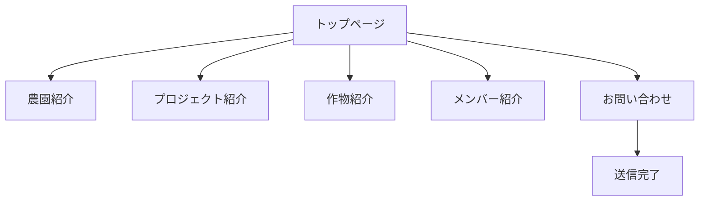
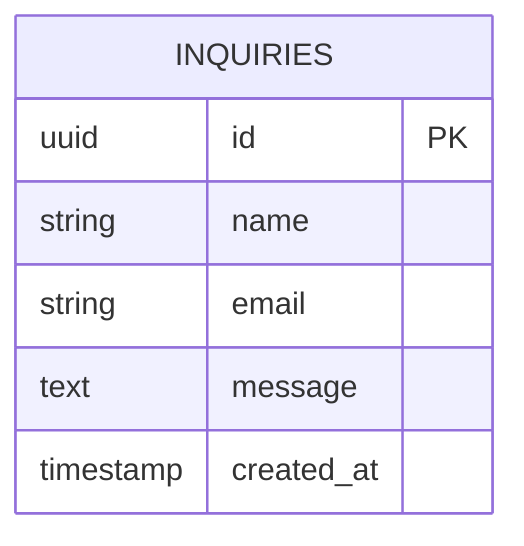
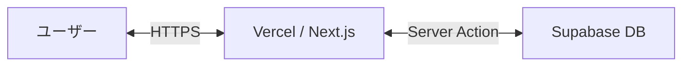
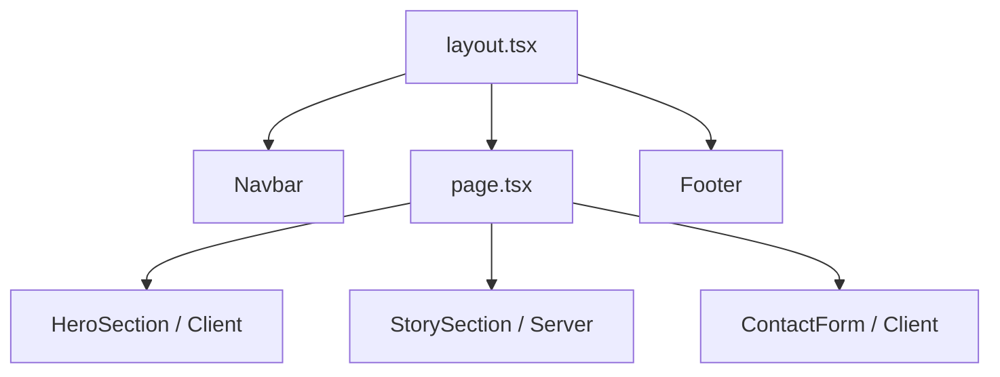

# 詳細要件定義書

## 1. プロジェクト概要

### 1.1 プロジェクト名
**「西川農園 コーポレートサイト構築プロジェクト」**

### 1.2 背景・目的
- **背景**: 山梨県甲州市を拠点とする西川農園では、果樹栽培や学生参画型農業を展開しているが、これらの活動を体系的に伝える公式な場がなく、取引先（卸・企業）への信頼性向上や活動背景の可視化が急務となっている。
- **目的**: 西川農園の「ストーリー」を可視化し、信頼できる「名刺代わり」の公式サイトを構築することで、取引先との円滑な関係構築と、地域・関係人口の土台作りを実現する。

### 1.3 システムのビジョン / スコープ
- **ビジョン**: 西川農園の想いと活動が、温かみと洗練さを兼ね備えたデザインで伝わり、関わるすべての人に信頼と共感を与えるデジタル基盤。
- **スコープ**: MVPとして、農園の概要、ストーリー、学生プロジェクト、作物紹介、メンバー紹介、およびお問い合わせ機能を備えたWebサイトを構築する。EC機能や会員管理は将来的な拡張とし、本フェーズでは対象外とする。

---

## 2. ビジネス要件

### 2.1 ビジネスモデル情報（簡易要約）
- **解決する課題**: 公式情報の散在、活動の可視化不足。
- **価値提案**: 透明性の高い栽培プロセス、学生参画による新しい農業モデルの提示。
- **収益構造**: 本サイト自体は非収益プロダクト。信頼構築による取引拡大への間接的貢献。

### 2.2 成果指標（KPI/KGI）
- **定性的指標**:
    - 取引先等への公式URL提供が可能になる。
    - 初見の閲覧者が「西川農園」の全体像を3分以内に理解できる。
- **定量的指標 (仮定)**:
    - 月間PV数: 100件（初期段階）

### 2.3 ビジネス上の制約
- **予算**: SaaS無料枠（Vercel, Supabase）を中心としたランニングコスト0円。
- **リソース**: 学生メンバー主体での開発・運用負荷の最小化。
- **納期**: 早急なMVPリリース（Cursorを活用したスピード開発）。

---

## 3. ユーザー要件

### 3.1 ユーザープロファイル / ペルソナ
1. **取引先担当者（企業・卸）**
    - 40代男性。信頼性を重視し、農園の背景や代表者の想いを確認してから取引を判断したいと考えている。
2. **一般閲覧者（20〜40代）**
    - 地域の農業や体験プロジェクトに関心がある。スマートフォンでの閲覧が主で、視覚的な印象と共感できるストーリーを求めている。

### 3.2 ユーザーストーリー
- 卸会社のバイヤーとして、西川農園の活動方針と栽培環境を知りたい。なぜなら、自社の顧客に自信を持って提供できる農家か判断したいからだ。
- 農業に関心のある学生として、実際にどんな学生がどのような活動をしているか知りたい。なぜなら、自分もこのプロジェクトに参加するイメージを持ちたいからだ。
- 一般消費者として、誰が作っているかを確認したい。なぜなら、安心感を持って農産物を購入・応援したいからだ。

### 3.3 MVP（Minimum Viable Product）の定義
- **実装範囲**: トップ、農園ストーリー、プロジェクト紹介、お問い合わせ、作物/メンバー紹介（簡易）。
- **ゴール**: 西川農園の公式な顔として、信頼性を確立し、外部とのコンタクトポイント（フォーム）を設置すること。

---

## 4. 機能要件

### 4.1 機能一覧 / MoSCoW 分類

| 機能 ID | 機能名 | 要約 | Must/Should/Could/Won't | MVP 対象 |
|---|---|---|---|---|
| F-001 | トップページ | 世界観の提示・ナビゲーション | Must | Yes |
| F-002 | 農園紹介(ストーリー) | 歴史・背景・想いの掲載 | Must | Yes |
| F-003 | プロジェクト紹介 | 学生参画の取り組み紹介 | Must | Yes |
| F-004 | お問い合わせフォーム | 送信機能（Supabase連携） | Must | Yes |
| F-005 | 作物紹介 | 栽培作物の写真と特徴 | Should | Yes |
| F-006 | メンバー紹介 | 活動に関わる人の紹介 | Should | Yes |
| F-007 | SNSリンク | Instagramなどへの導線 | Could | Yes |

### 4.2 機能詳細仕様

#### 4.2.1 `<機能 ID: F-001 トップページ>`
- **概要**: サイトのポータル画面。西川農園の空気感を伝え、各ページへ誘導する。
- **ユースケース**: 「URLを渡された取引先が最初に閲覧する」
- **正常系フロー**: アクセス → ヒーローセクション表示 → コンテンツ要約閲覧 → 各詳細ページへ遷移。
- **UI 要件**: モバイルファースト。高品質な背景画像/動画。スクロールに応じた動的演出。

#### 4.2.2 `<機能 ID: F-002 農園紹介／ストーリー>`
- **概要**: 代表のメッセージや農園の歴史をテキストと写真で構成。
- **正常系フロー**: ページ移動 → 農園主の想いを読む → 信頼感を得る。
- **UI 要件**: 読了感を高めるタイポグラフィ、温かみのあるカラーリング。

#### 4.2.3 `<機能 ID: F-006 お問い合わせフォーム>`
- **概要**: ユーザーからの質問や依頼を受け付ける。
- **正常系フロー**: 項目入力（名前, メール, 内容）→ 規約同意（任意）→ 送信 → 送信完了メッセージ表示（祝）。
- **例外系フロー**: バリデーションエラー表示、送信失敗時のエラー表示（SaaS側原因など）。
- **UI 要件**: シンプルな1カラム構成。送信ボタンのローディング表示。

---

## 5. UI/UX設計

### 5.1 デザインコンセプト
- **「土の温もりと、若き躍動」**
- キーワード：温かい / 自然 / 信頼 / 洗練 / 次世代
- 農業への深いリスペクトを持ちつつ、学生の活気をスタイリッシュに表現する。

### 5.2 デザイン要素（提案）
- **カラーパレット**:
    - メイン：フォレストグリーン（#2D5A27 / 信頼・自然）
    - サブ：アースベージュ（#F2E8D5 / 温かみ・土）
    - アクセント：テラコッタ（#B3543D / 躍動・情熱）
- **タイポグラフィ**: 明朝体（見出し：誠実さ）＋ ゴシック体（本文：可読性）。

### 5.3 画面遷移図

### 5.4 ワイヤーフレーム（テキストベース）
- **トップページ**: [Header (Logo/Menu)] -> [Hero: 農園の風景 + CatchCopy] -> [About: 簡潔な説明] -> [Topics: プロジェクト紹介抜粋] -> [Contact CTA] -> [Footer]
- **農園紹介**: [Visual Banner] -> [Section: 想い (Text/Photo)] -> [Section: 歴史 (Timeline)]
- **お問い合わせ**: [Form Header] -> [Input: Name/Email/Message] -> [Submit Button]

---

## 6. 非機能要件

- **パフォーマンス**: ページ読み込み3秒以内（SSG活用）。
- **セキュリティ**: 常時SSL、入力バリデーション、CSRF対策（SaaS側機能含む）。
- **運用性 (仮定)**: 更新は学生メンバーがCursor経由でGitHubにプッシュする形式。
- **スケーラビリティ**: Vercelによる自動スケール。初期は少数アクセスを想定。

---

## 7. データベース設計

### 7.1 ER図

### 7.2 テーブル定義
- **inquiries**: お問い合わせ情報を蓄積
    - `id`: primary key (UUID)
    - `name`: text (not null)
    - `email`: text (not null)
    - `message`: text (not null)
    - `created_at`: timestamp (with time zone, local default: now())

---

## 8. インテグレーション要件

- **SaaS連携**:
    - **Supabase**: データベースおよびAPIエンドポイント。
    - **Vercel**: ホスティングおよびデプロイ自動化。
- **API 通信**:
    - `POST /api/contact`: フォームデータの送信。
    - バリデーション後に Supabase API 経由でデータ登録。

---

## 9. 技術選定とアーキテクチャ

### 9.1 技術スタック
- **Frontend**: Next.js 14+ (App Router), Tailwind CSS v3+
- **Language**: TypeScript
- **Database**: Supabase
- **Hosting**: Vercel

### 9.2 アーキテクチャ概要

### 9.3 コンポーネント階層図

---

## 10. リスクと課題

- **技術的リスク**: Supabase の無料枠制約（休眠状態など）。-> (対応) 定期的なアクセスの確保。
- **運用リスク**: コンテンツの陳腐化。-> (対応) 2ページ程度の更新に留めるシンプル設計。
- **情報発信上のリスク**: 誤情報の掲載。-> (対応) デプロイ前のレビュー徹底。

---

## 11. ランニング費用と運用方針 (仮定)

- **費用**: 
    - ドメイン代: 年間約1,500円。
    - Vercel/Supabase: 0円（無料枠維持）。
- **体制**: 
    - 学生メンバー1名が開発、農園主が内容確認。
    - Cursor を活用し、技術的な壁を AI で補完する。

---

## 12. 変更管理
- GitHub リポジトリによるバージョン管理。
- Issue および Pull Request 単位での機能追加・修正。

---

## 13. 参考資料
- `docs/output/system_requirements.md`
- デザイン参考サイト: https://www.nissanmotor.jobs/japan/MC/
